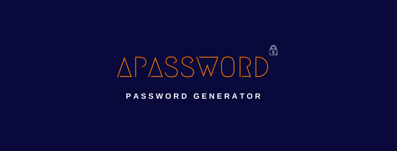
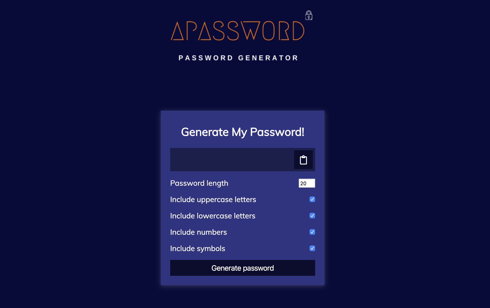
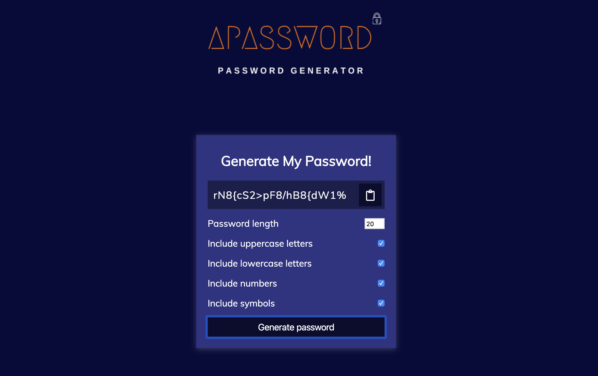
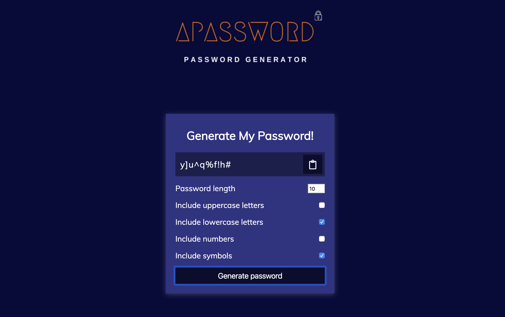
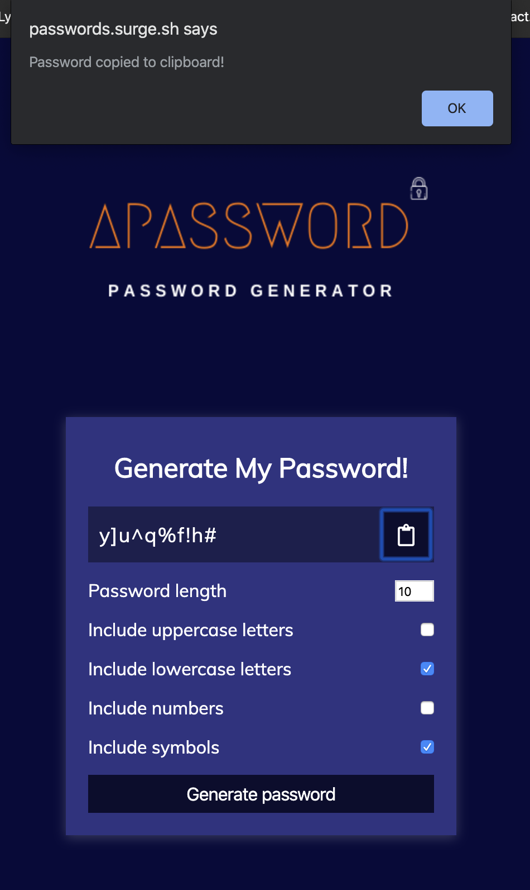

<h1>APassword</h1>

<h2>About</h2> 
Generate a random password that's up to 20 characters long with this simple password generator!

<h2>How to Use</h2> 
Select the type of password you'd like generated by checking a combination of lower/uppercase letters, symbols, or numbers.
Once a password is generated, you can copy the password to your clipboard by clicking on the clipboard button.

<h2>Technology Used</h2>
JavaScript, CSS, HTML

<h2>Live Link</h2>
http://passwords.surge.sh/

 
 

 

 

 

